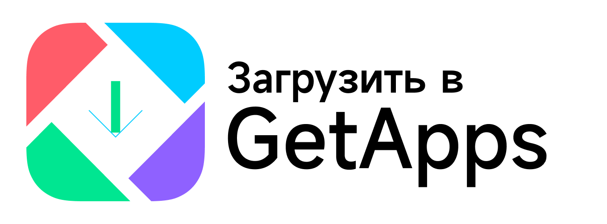
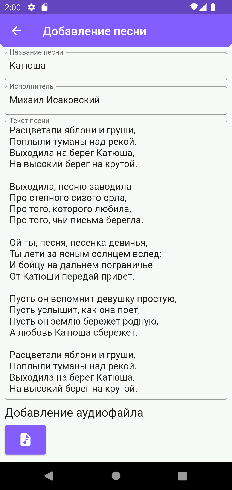
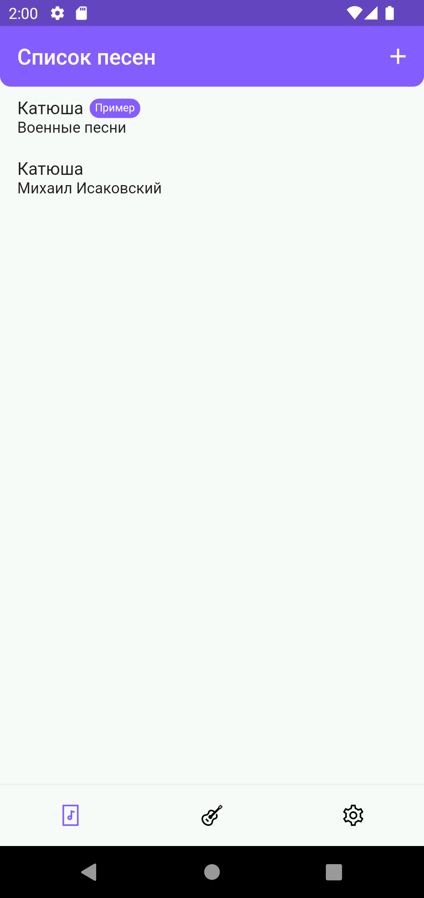
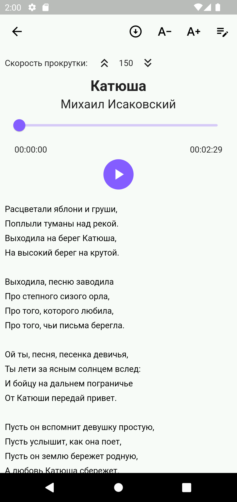
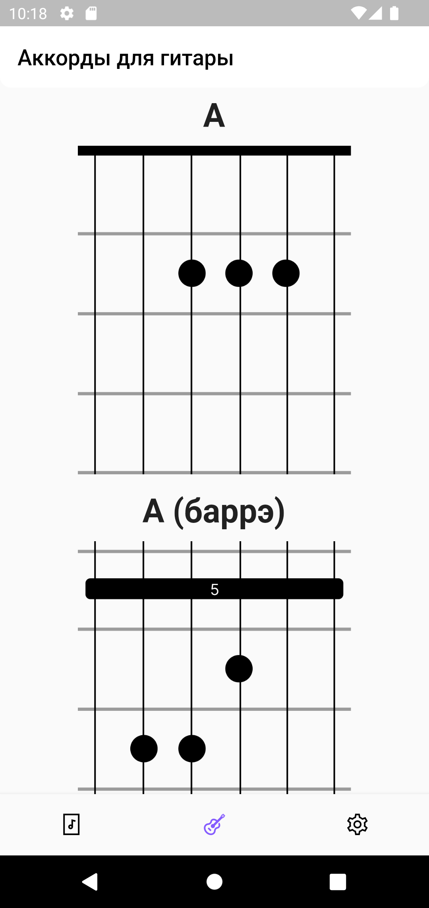

#  My Songbook

*Ваш мобильный песенник - все любимые песни всегда под рукой!*

Мобильное приложение для гитаристов, певцов, композиторов и всех желающих, которые хотят записывать свои песни или создавать новые композиции.

## Разработка
Мобильное приложение разработано на языке Dart со специальным фреймворком Flutter. 
My Songbook имеет множество функций, такие как добавление песни с аудиофайлом одновременно на своем устройстве. Хранение всех данных работает локально на каждом устройстве с помощью БД sqlite, что позволяет пользоваться без Интернета: в дороге, в самолете и в метро.
Процесс создания приложения ушло раньше 1-го месяца и выпущено 25 августа 2023 года, а позже было обновлено с добавлением новых настроек: режим темы, локализация и расширение техподдержки.

## Публикация
После создания приложения решил попробовать выпустить на российском маркетплейсе RuStore. 1.0.0 версия была опубликована 25.08.23, а позже обновлено до 1.2.2 1-го сентября уже во многих маркетплейсах, такие как AppGallery (Huawei) и GetApps (Xiaomi).

## История версии

### 1.0.0

Первая версия

### 1.2.2

1. Добавлен темный режим

Теперь вы можете изменить тему, для этого нужно зайти в раздел "Настройки", затем в "Режим темы" и выбрать свой режим

2. Добавлена локализация - "Английский" и "Китайский (экспериментальная)"

3. Добавлена возможность обращаться к нам в Telegram

4. Исправлены мелкие ошибки

### 1.3.4

1. Добавлена возможность отправки песни с аудиофайлом
2. В настройках добавлена возможность обратиться к нам с вопросами по электронной почте. Для этого нужно зайти ->"Настройки"- > "Обратиться в техподдержку" и нажимаем на иконку почты
3. Исправлены функции с изменением локализаций. Теперь вы можете не выходить из приложения, а просто в настройках переключить локализацию и программа все сама сделает
4. Исправлены мелкие ошибки

### 1.4.6

Теперь наше приложение стало еще удобнее!
- Вы можете редактировать название исполнителя, название песни и даже сам аудиофайл в любое время
- Мы добавили новый баннер, на котором отображаются предстоящие события, рекомендации и другая полезная информация
- Добавили поиск песни по имени исполнителя или по названию песни
- Исправлены мелкие ошибки
Если у вас возникнут какие-то вопросы, пожалуйста, обратитесь к разработчику по адресу электронной почты ru-developer@mail.ru.
Счастливого Нового года!

### Скрины приложения

